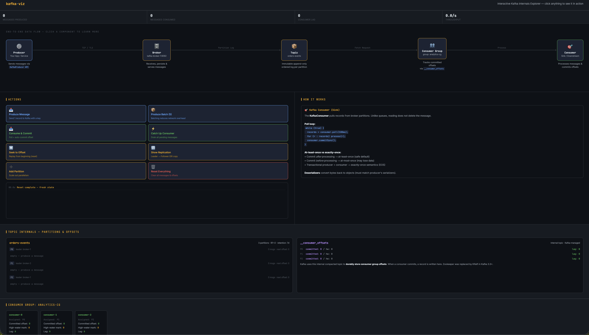

# kafka-viz

An interactive, single-file HTML visualizer for Apache Kafka internals. Built to make the end-to-end message flow — from producer to broker to consumer — tangible and clickable rather than something you read about in a diagram.

No dependencies. No build step. Open the file in a browser.

---

## What it shows



### End-to-end pipeline

A live animated pipeline: **Producer → Broker → Topic → Consumer Group → Consumer**. Clicking any component opens a detailed explanation of its internals, configs, and gotchas.

Animated particles travel through the pipeline on every action so you can see exactly which path a message takes.

### Topic internals — partitions and offsets

Each partition renders as a row of offset cells. Color tells you the state at a glance:


| Color          | Meaning                     |
| -------------- | --------------------------- |
| Default (dark) | Written, not yet consumed   |
| Amber border   | Newly written (animates in) |
| Green border   | Consumed and committed      |


- `HEAD` pointer marks the latest written offset
- `▲cg` pointer marks where the consumer group is currently positioned
- Click any individual offset cell for a per-message breakdown (key, value, offset, status)

### `__consumer_offsets`

The internal Kafka topic that stores consumer group positions is rendered live — committed offset, high-water mark, and lag per partition update in real time as you interact.

### Consumer group panel

Shows each consumer's partition assignment, committed offset, high-water mark, and current lag. Lag turns red when messages are unread.

---

## Interactive actions


| Button                | What it simulates                                                                                 |
| --------------------- | ------------------------------------------------------------------------------------------------- |
| **Produce Message**   | Sends one record. Shows key-based partitioning, the producer buffer, broker append, and ACK flow  |
| **Produce Batch (5)** | Sends five records. Explains `linger.ms`, `batch.size`, and why batching matters for throughput   |
| **Consume & Commit**  | Polls one message, advances the consumer offset, explains at-least-once vs exactly-once semantics |
| **Catch Up Consumer** | Drains all pending messages — lag goes to zero                                                    |
| **Seek to Offset**    | Resets all consumer offsets to 0, explains event replay and `seekToBeginning()`                   |
| **Show Replication**  | Explains leader/follower replication, ISR, and `acks=all`                                         |
| **Add Partition**     | Adds a new partition live, triggers a virtual consumer group rebalance                            |
| **Reset Everything**  | Clears all state back to a clean slate                                                            |


---

## Concepts covered

- **Partitioning** — how `hash(key) % numPartitions` routes messages
- **Offsets** — monotonically increasing, broker-assigned, never deleted on read
- **High-water mark** — the last committed (fully replicated) offset
- **Consumer lag** — high-water mark minus committed offset
- **ISR (In-Sync Replicas)** — which replicas are caught up with the leader
- `**__consumer_offsets`** — the compacted internal topic that stores group positions
- **Rebalancing** — what triggers it, what happens during it
- **Event replay** — seeking back to offset 0 to reprocess retained messages
- **Batching** — `RecordAccumulator`, `linger.ms`, `batch.size`
- **Delivery semantics** — at-most-once, at-least-once, exactly-once (EOS)
- **KRaft** — brief note on ZooKeeper replacement in Kafka 3.3+

---

## Usage

```bash
# Just open it
open kafka-visualizer.html

# Or serve it locally
python -m http.server 8080
# then visit http://localhost:8080/kafka-visualizer.html
```

No npm install. No bundler. The file is fully self-contained.

---

## Suggested walkthrough

1. Click **Produce Message** — watch the particle travel and the offset cell appear
2. Click **Produce Batch (5)** — see multiple partitions fill up
3. Click the `HEAD` offset cell — inspect an individual message
4. Click **Consume & Commit** — watch the green consumed state and offset advance
5. Click **Seek to Offset** — reset and replay from the beginning
6. Click **Show Replication** — understand ISR and durability guarantees
7. Click **Add Partition** — see the consumer group rebalance
8. Click any pipeline component for a deep-dive on its internals

---

## Stack

Pure HTML, CSS, and vanilla JavaScript. No frameworks, no external runtime dependencies. Google Fonts (`JetBrains Mono`, `Inter`) loaded via CDN for the monospace/sans pairing — works offline if you swap those out.

---

## Related

- [Apache Kafka Documentation](https://kafka.apache.org/documentation/)
- [Kafka: The Definitive Guide](https://www.confluent.io/resources/kafka-the-definitive-guide/) — Confluent free PDF
- [Confluent Developer](https://developer.confluent.io/) — hands-on courses

